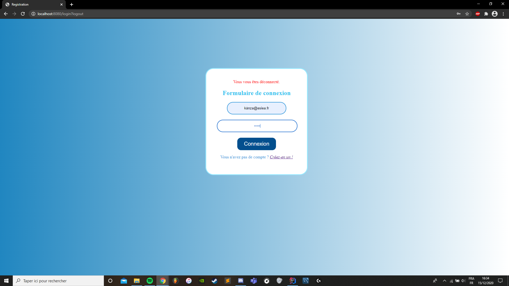

# NewMedApp

Projet: Application web médicale 

## Technologies utilisées

Java pour le back,  HTML/CSS/BOOTSTRAP/JS pour le front, MySQL Workbench pour la bdd

### Présentation de l'application 

- En lançant l'application, l'utilisateur peut s'inscrire ou se connecter s'il possède deja un compte.
 
 

- Une fois connecté, l'utilisateur est sur la page d'accueil. 

- Pour changer de section il peut d'une part selectionner l'onglet de son choix (en haut) ou d'autre part scroller pour changer de page.
- L'onglet Medecins permet de rechercher/filtrer par spécialité des medécins et d'afficher leur nom, age, ville et tarif dans l'optique d'un futur rendez-vous. 
- L'onglet Mes Rendez-Vous permet à l'utilisateur de selectionner un rdv, de l'afficher ou de le supprimer. Une sauvegarde par session est effectuée. 

 

 

